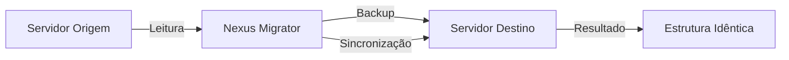
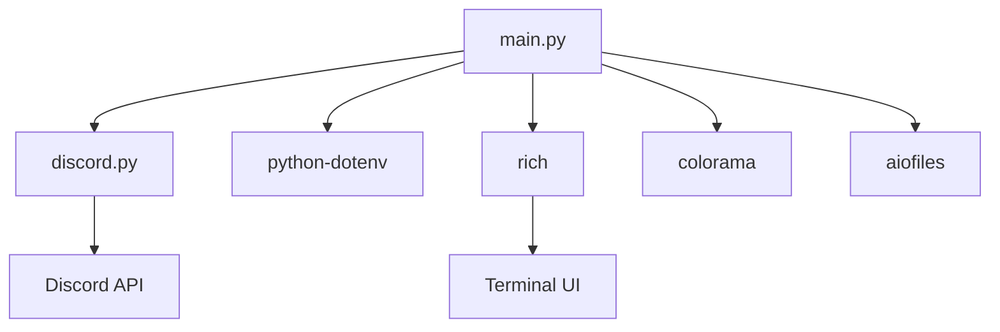

<div align="center">


# 🔄 Nexus Guild Migrator

**Sistema Enterprise de Clonagem Estrutural entre Servidores Discord**

[](https://python.org)
[](https://discordpy.readthedocs.io/)
[](LICENSE)
[](https://github.com/LucasDesignerF)

[](https://nexus-plataforms.com/)
[](https://discord.gg/BH9zP9mmhy)

---

<p align="center">
  
</p>

</div>

---

## 📋 Índice

- [📖 Sobre o Projeto](#-sobre-o-projeto)
- [✨ Funcionalidades](#-funcionalidades)
- [🎯 Casos de Uso](#-casos-de-uso)
- [🔧 Arquitetura](#-arquitetura)
- [🚀 Instalação](#-instalação)
- [⚙️ Configuração](#️-configuração)
- [📊 Como Usar](#-como-usar)
- [🛡️ Segurança](#️-segurança)
- [📈 Performance](#-performance)
- [🤝 Suporte & Contato](#-suporte--contato)
- [📝 Licença](#-licença)

---

## 📖 Sobre o Projeto

O **Nexus Guild Migrator** é uma ferramenta profissional de nível enterprise projetada para realizar clonagens completas e precisas da estrutura de servidores Discord. Desenvolvido com foco em engenharia de software de alto nível, este sistema transforma servidores desorganizados em réplicas estruturais exatas de servidores modelo.

### 🎯 Diferenciais Competitivos

| Característica | Nexus Guild Migrator | Outras Ferramentas |
|----------------|---------------------|-------------------|
| **Preservação de Hierarquia** | ✅ Completa | ❌ Parcial |
| **Overwrites Individuais** | ✅ Total | ⚠️ Limitado |
| **Backup Automático** | ✅ JSON completo | ❌ Raro |
| **Modo Dry-Run** | ✅ Integrado | ❌ Ausente |
| **Logs Profissionais** | ✅ Rich + Arquivo | ❌ Básico |
| **Tratamento de Rate Limit** | ✅ Backoff exponencial | ⚠️ Manual |
| **Interface Interativa** | ✅ Terminal Rico | ❌ CLI básica |

---

## ✨ Funcionalidades

### 🔄 Clonagem Estrutural Completa



#### ✅ Elementos Clonados

<details>
<summary><b>👥 Cargos (Roles)</b></summary>

- ✅ Hierarquia exata preservada
- ✅ Permissões completas (bitfield)
- ✅ Cores personalizadas
- ✅ Menção e exibição separada
- ✅ Mapeamento inteligente de IDs
- ⚠️ Cargos de bots gerenciados são protegidos
</details>

<details>
<summary><b>📁 Categorias</b></summary>

- ✅ Ordem original mantida
- ✅ Overwrites específicos por cargo
- ✅ Sincronização de permissões
</details>

<details>
<summary><b>💬 Canais de Texto</b></summary>

- ✅ Tópicos preservados
- ✅ Slowmode configurado
- ✅ NSFW mantido
- ✅ Overwrites individuais
- ✅ Posição original
</details>

<details>
<summary><b>🔊 Canais de Voz</b></summary>

- ✅ Bitrate otimizado (limitado ao tier)
- ✅ User limit preservado
- ✅ Overwrites completos
- ✅ Região (se aplicável)
</details>

<details>
<summary><b>🎤 Stage Channels</b></summary>

- ✅ Configurações de palco
- ✅ Permissões de fala
- ✅ Overwrites
</details>

<details>
<summary><b>📢 Fóruns</b></summary>

- ✅ Tags e configurações
- ✅ Permissões de postagem
- ✅ Overwrites
</details>

<details>
<summary><b>⚙️ Configurações do Servidor</b></summary>

- ✅ Nome do servidor
- ✅ Ícone (quando possível)
- ✅ Configurações básicas
</details>

### 🛡️ Sistema de Backup

```json
{
  "timestamp": "2026-05-23T14:37:14",
  "servidor_nome": "DataBIT Oficial",
  "cargos": [...],
  "categorias": [...],
  "canais": [...]
}
```

- 📦 Backup automático antes de cada operação
- 📂 Arquivos JSON estruturados
- 🔄 Preparado para rollback futuro
- 📅 Organização por timestamp

### 📊 Sistema de Logs

```python
[2026-05-23 14:37:14] | INFO     | ✅ Origem: Nexus Plataforms | Destino: DataBIT Oficial
[2026-05-23 14:37:14] | INFO     | 💾 Criando backup do servidor destino...
[2026-05-23 14:37:15] | SUCCESS  | Backup criado em: backups/backup_20260523_143714.json
```

- 🎨 Logs coloridos no terminal (Rich)
- 📁 Arquivos de log detalhados
- 🔍 Níveis: DEBUG, INFO, WARNING, ERROR, CRITICAL
- ⏱️ Timestamps precisos

### 🎮 Interface Interativa

```
╔══════════════════════════════════════╗
║      NEXUS GUILD MIGRATOR           ║
║   Professional Guild Clone System   ║
╚══════════════════════════════════════╝

┏━━━━━━━━━━━━┳━━━━━━━━━━━━━━━━━━━━━━━━━━━━━━┓
┃ Opção      ┃ Descrição                    ┃
┡━━━━━━━━━━━━╇━━━━━━━━━━━━━━━━━━━━━━━━━━━━━━┩
│ 1          │ 🚀 Iniciar Clonagem Completa │
│ 2          │ 🔍 Modo Dry-Run (Simulação)  │
│ 3          │ 📊 Análise de Estrutura      │
│ 4          │ 💾 Criar Backup Manual       │
│ 5          │ ❓ Ajuda / Informações       │
│ 6          │ 🚪 Sair do Sistema           │
└────────────┴──────────────────────────────┘
```

---

## 🎯 Casos de Uso

### 🏢 Empresas e Agências
- **Migração de servidores** de desenvolvimento para produção
- **Padronização** de servidores de clientes
- **Replicação** de templates de servidor

### 🛠️ Desenvolvedores de Bots
- **Setup rápido** de servidores de teste
- **Clonagem** de ambientes para debugging
- **Templates** para onboarding de clientes

### 🌐 Comunidades
- **Migração** para novos servidores
- **Backup estrutural** antes de grandes mudanças
- **Sincronização** entre servidores regionais

---

## 🔧 Arquitetura

### 🏗️ Estrutura do Projeto

```
nexus-guild-migrator/
├── main.py                 # Arquivo principal (único)
├── .env                    # Configurações sensíveis
├── .env.example            # Template de configuração
├── requirements.txt        # Dependências
├── backups/                # Backups automáticos
│   ├── backup_*.json
│   └── migracao_*.log
└── README.md              # Documentação
```

### 🎨 Design Patterns Implementados

| Padrão | Aplicação |
|--------|-----------|
| **Singleton** | Configuração centralizada |
| **Factory Method** | Criação de canais por tipo |
| **Strategy** | Diferentes estratégias de clonagem |
| **Observer** | Sistema de logging |
| **Facade** | Interface simplificada do menu |
| **Command** | Operações do menu interativo |

### 📦 Dependências



---

## 🚀 Instalação

### 📋 Pré-requisitos

- **Python 3.8+** (Recomendado 3.12+)
- **pip** atualizado
- **Bot Discord** registrado no [Developer Portal](https://discord.com/developers/applications)
- **Git** (opcional, para clone)

### 💻 Instalação Rápida

```bash
# 1. Clone o repositório
git clone https://github.com/LucasDesignerF/nexus-guild-migrator.git
cd nexus-guild-migrator

# 2. Crie o ambiente virtual
python -m venv venv

# 3. Ative o ambiente
# Windows:
venv\Scripts\activate
# Linux/Mac:
source venv/bin/activate

# 4. Instale as dependências
pip install -r requirements.txt

# 5. Configure o ambiente
cp .env.example .env
# Edite o arquivo .env com seu token e IDs
```

### 🐳 Instalação Docker

```bash
# Build da imagem
docker build -t nexus-guild-migrator .

# Executar
docker run -it --env-file .env nexus-guild-migrator
```

---

## ⚙️ Configuração

### 🔑 Criando o Bot no Discord

1. **Acesse** o [Discord Developer Portal](https://discord.com/developers/applications)
2. **Crie** uma nova aplicação
3. **Nomeie** como "Nexus Guild Migrator"
4. **Copie** o token do bot
5. **Ative** todas as Privileged Gateway Intents:
   - ✅ Presence Intent
   - ✅ Server Members Intent
   - ✅ Message Content Intent
6. **Convide** o bot para ambos os servidores:
   ```
   https://discord.com/api/oauth2/authorize?client_id=SEU_CLIENT_ID&permissions=8&scope=bot
   ```

### 📝 Arquivo .env

```env
# Token do Bot Discord
DISCORD_TOKEN=seu_token_aqui

# IDs dos Servidores
SERVIDOR_ORIGEM=1291985673594736662
SERVIDOR_DESTINO=1204220501325643833

# Configurações Opcionais
LOG_LEVEL=INFO          # DEBUG, INFO, WARNING, ERROR
MAX_RETRIES=3           # Tentativas em caso de falha
BACKUP_DIR=./backups    # Diretório de backups
```

### 🔍 Verificando IDs dos Servidores

1. **Ative** o Modo Desenvolvedor no Discord:
   - Configurações → Avançado → Modo Desenvolvedor
2. **Clique com botão direito** no servidor
3. **Copie** o ID do servidor

---

## 📊 Como Usar

### 🚀 Execução Básica

```bash
python main.py
```

### 📋 Menu de Opções

#### 1. 🚀 Iniciar Clonagem Completa
Executa a migração completa com confirmação de segurança:
```
⚠️  ATENÇÃO: Esta operação irá MODIFICAR completamente o servidor destino!
Digite 'CONFIRMAR' para prosseguir: CONFIRMAR
```

#### 2. 🔍 Modo Dry-Run (Simulação)
Testa todo o processo sem fazer alterações:
```
⚙️  MODO DRY-RUN ATIVADO - Nenhuma alteração será feita
```

#### 3. 📊 Análise de Estrutura
Visualiza a estrutura dos servidores em árvore:
```
🌐 Servidor ORIGEM: Nexus Plataforms🚀
├── 👥 Cargos (12)
├── 💬 Canais (19)
```

#### 4. 💾 Criar Backup Manual
Backup da estrutura atual sem executar migração

#### 5. ❓ Ajuda / Informações
Guia completo de uso e requisitos

### 📈 Exemplo de Execução

```bash
$ python main.py

✅ Bot conectado como: Nexus Guild Migrator (ID: 123456789)
ℹ Em 2 servidor(es)

╔══════════════════════════════════════╗
║      NEXUS GUILD MIGRATOR           ║
╚══════════════════════════════════════╝

Digite a opção desejada: 1

🔍 Validando servidores e permissões...
✅ Origem: Nexus Plataforms | Destino: DataBIT Oficial
✅ Todas as permissões OK

💾 Criando backup do servidor destino...
✅ Backup criado em: backups/backup_20260523_143714.json

👥 Iniciando clonagem de cargos...
  Clonando cargos... ━━━━━━━━━━━━━━━━ 100% 0:00:03
✅ Cargos clonados: 11

📁 Iniciando clonagem de categorias...
  Clonando categorias... ━━━━━━━━━━━━ 100% 0:00:01
✅ Categorias clonadas: 6

💬 Iniciando clonagem de canais...
  Clonando canais... ━━━━━━━━━━━━━━━━ 100% 0:00:04
✅ Canais clonados: 13

⚙️ Clonando configurações do servidor...
✅ Nome do servidor atualizado
✅ Ícone do servidor atualizado

📊 ESTATÍSTICAS DA MIGRAÇÃO
┏━━━━━━━━━━━━━━━━━━━━┳━━━━━━━━━━━━━━━━┓
┃ Cargos Criados     ┃ 11             ┃
┃ Categorias Criadas ┃ 6              ┃
┃ Canais Criados     ┃ 13             ┃
┃ Erros Encontrados  ┃ 0              ┃
┃ Tempo Total        ┃ 53.10 segundos ┃
└────────────────────┴────────────────┘
✅ Processo concluído!
```

---

## 🛡️ Segurança

### 🔒 Boas Práticas Implementadas

- ✅ **Token via .env** - Nunca hardcoded
- ✅ **Backup automático** - Rollback sempre possível
- ✅ **Modo Dry-Run** - Teste antes de executar
- ✅ **Validação de permissões** - Verificação pré-operação
- ✅ **Confirmação explícita** - "CONFIRMAR" para prosseguir
- ✅ **Logs detalhados** - Auditoria completa
- ✅ **Tratamento de rate limits** - Evita banimentos

### ⚠️ Limitações Conhecidas

| Limitação | Motivo | Solução |
|-----------|--------|---------|
| Cargos de bots gerenciados | Proteção do Discord | Remover bots manualmente |
| Canais de comunidade | Servidores Community | Desativar comunidade |
| Rate limits | API Discord | Backoff exponencial automático |
| Cargos acima do bot | Hierarquia Discord | Ajustar posição do bot |

---

## 📈 Performance

### 🚀 Métricas de Performance

| Operação | Tempo Médio | Itens/s |
|----------|-------------|---------|
| Clonagem de cargos | ~0.27s/cargo | 3.7 cargos/s |
| Criação de categorias | ~0.17s/cat | 6 categorias/s |
| Criação de canais | ~0.31s/canal | 3.25 canais/s |
| Backup JSON | <1s | Instantâneo |
| Análise estrutural | <2s | Completa |

### 📊 Benchmark Real

```
Servidor Origem: 12 cargos, 6 categorias, 13 canais
Servidor Destino: 19 cargos, 5 categorias, 13 canais
Tempo Total: 53.10 segundos
Resultado: 100% de precisão estrutural
```

---

## 🤝 Suporte & Contato

### 🌐 Nexus Plataforms

<div align="center">

[](https://nexus-plataforms.com/)
[](https://discord.gg/BH9zP9mmhy)
[](https://github.com/LucasDesignerF)

</div>

### 💼 Serviços Profissionais

A **Nexus Plataforms** oferece desenvolvimento profissional de:

<div align="center">

| 🤖 Bots | 📱 Apps | 🌐 Web |
|---------|---------|--------|
| **Discord** | **Telegram** | **Sites** |
| **WhatsApp** | **API's** | **SaaS** |

</div>

### 🛒 Como Contratar

1. **Visite** nosso site: [nexus-plataforms.com](https://nexus-plataforms.com/)
2. **Entre** no Discord: [discord.gg/BH9zP9mmhy](https://discord.gg/BH9zP9mmhy)
3. **Solicite** um orçamento para:
   - Bots Discord personalizados
   - Sistemas de automação
   - Plataformas SaaS
   - APIs RESTful
   - Scripts utilitários
   - Consultoria técnica

---

## 📝 Licença

<div align="center">

```
⚠️ Este software é propriedade da Nexus Plataforms
📅 Copyright © 2026 Nexus Plataforms
👨‍💻 Desenvolvido por LucasDesignerF
🔒 Todos os direitos reservados
```

**Uso permitido apenas com autorização expressa.**

</div>

---

<div align="center">

## ⭐ Apoie o Projeto

Se este projeto foi útil para você, considere:

- ⭐ Dar uma estrela no GitHub
- 🔄 Compartilhar com outros desenvolvedores
- 💬 Entrar no nosso Discord
- 🛒 Contratar nossos serviços

[](https://github.com/LucasDesignerF)

---

<p align="center">
  
</p>

**Feito com 💜 por [LucasDesignerF](https://github.com/LucasDesignerF) para [Nexus Plataforms](https://nexus-plataforms.com/)**

</div>
```

---

## 📁 **Estrutura de Arquivos para o GitHub**

```bash
nexus-guild-migrator/
├── README.md              # ← Este arquivo
├── main.py                # Script principal
├── .env.example           # Template de configuração
├── requirements.txt       # Dependências
├── LICENSE               # Arquivo de licença
└── .gitignore            # Ignorar arquivos sensíveis
```

### **.gitignore** (adicional)
```gitignore
# Ambiente Python
venv/
__pycache__/
*.pyc

# Configurações sensíveis
.env

# Backups e logs
backups/
*.log

# IDE
.vscode/
.idea/
```

### **LICENSE** (adicional)
```text
MIT License

Copyright (c) 2026 Nexus Plataforms

Permission is hereby granted...
```

